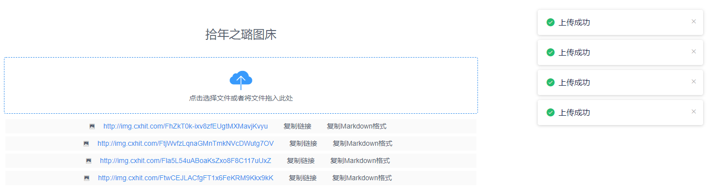
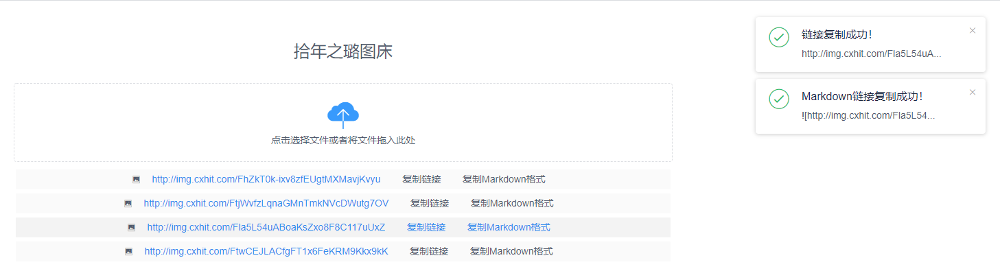
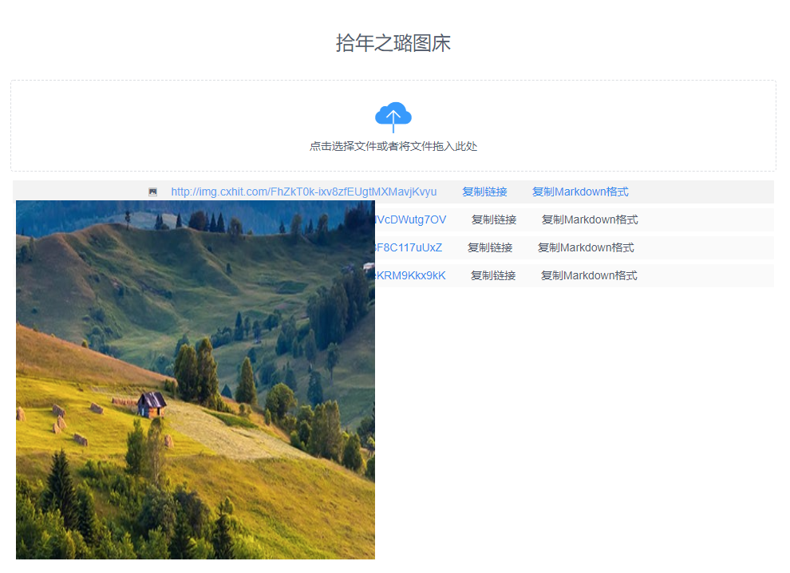

# 快速搭建自己的七牛云免费图床网站

### 0. 七牛云简介

> 七牛云为每位用户提供了 10G 的永久免费存储空间，和 10G/月 的http流量，使用七牛云搭建图床，在博客或者网站中引入链接，是不错的选择。
>
> 不过当前浏览器严格限制 https 协议访问，即开启 https 协议的网站，不再支持请求加载 http 资源，所以建议开启七牛云的 https 协议。
> 
> 七牛云https请求产生的流量单独计费，国内流量费用，第 0GB 至 100TB，0.28元/G。参考：https://developer.qiniu.com/fusion/6843/cdn-product-pricing


### 1. 项目简介

本项目基于 [mqllin](https://github.com/mqllin/QiNiuYun_UploadImage_tuchuang) 的项目，进行部分修改。

原始功能：

① 支持基本的选择文件上传，以及批量上传

② 支持`拖动`上传、`批量`拖动上传


**新增功能：**

③ 支持复制`URL`和`Markdown`格式的链接





④ 支持`预览图片`（鼠标放在链接上，即可显示图片）



点击链接，即可新窗口打开图片。

### 2. 使用说明

① 配置项目 `server\config.php` 文件中的 5 个变量；

② 修改 `index.html` 文件中的 `TODO` 位置的 `action选项`（即上传的空间）。

```text
action主要有：
    华　东：http(s)://upload.qiniup.com
    华　北：http(s)://upload-z1.qiniup.com
    华　南：http(s)://upload-z2.qiniup.com
    北　美：http(s)://upload-na0.qiniup.com
    东南亚：http(s)://upload-as0.qiniup.com
参　考：https://developer.qiniu.com/kodo/1671/region-endpoint-fq
```

### 3. LICENSE

+ 本项目原作者：[mqllin](https://github.com/mqllin/QiNiuYun_UploadImage_tuchuang
)
+ 原始项目LICENSE：Apache-2.0 License
+ 本项目LICENSE：Apache-2.0 License

--- END ---